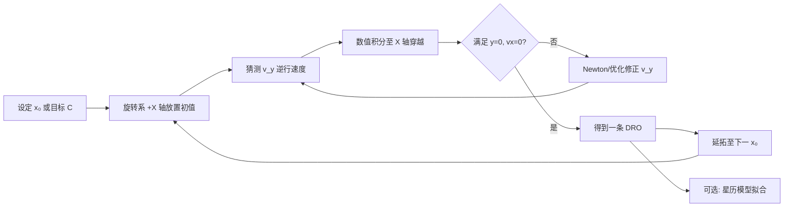
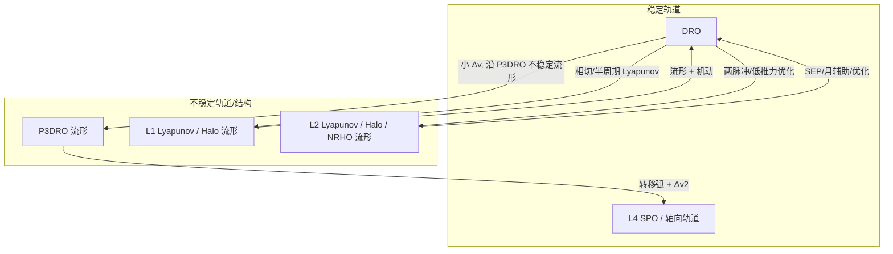
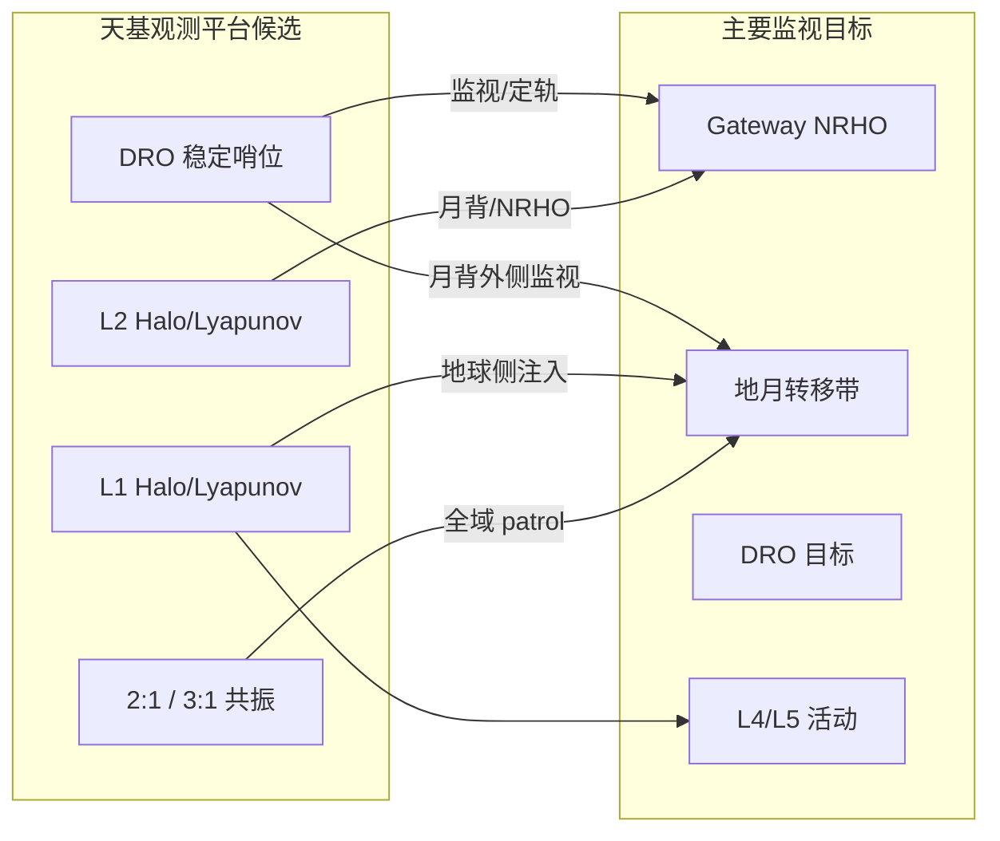

# 地月系统 DRO 轨道研究综述

## 一、概述

**Distant Retrograde Orbit（DRO，远距逆行轨道）** 是地月 **圆型限制性三体问题（CR3BP / CRTBP）** 中的一族周期解，最早由 Broucke（1968）和 Hénon（1969）在数值探索中发现，在 Hénon 分类中属于 **f 族**。在旋转坐标系中，DRO 表现为围绕月球 **逆行** 的准椭圆轨道，轨道尺度通常远大于低月轨，部分大振幅 DRO 可延伸至地月 **L1、L2** 附近甚至 **L4/L5** 区域。

近年来 DRO 重新受到关注，主要驱动因素包括：

- NASA **小行星重定向任务（ARM）** 曾考虑 DRO 作为捕获小行星的隔离轨道
- **Artemis I** 任务实际飞行验证了 DRO 的可行性（约 70,000 km 半径、双圈约 27 天）
- **Gateway** 等 cis-lunar 任务需要 DRO、NRHO、L4/L5 之间的转移基础设施

本文档基于公开文献调研，总结 DRO 的基本特性、创建方法，以及到 L4、L1/L2 HALO 轨道的转移策略。已下载的开放获取文献见 `DRO/文献/` 子文件夹，插图见 `DRO/pic/` 子文件夹。

**定轨与轨控专题**（位置/速度精度、站保持方法与频率）见：[`地月空间定轨与轨控.md`](地月空间定轨与轨控.md)。

---

## 二、DRO 基本特性与原理

### 2.1 动力学模型与定义

| 要素 | 说明 |
|------|------|
| 动力学模型 | 主要为 CR3BP；长期稳定性分析需加入太阳引力、月球非球形、太阳辐射压等（四体/星历模型） |
| 运动特征 | 旋转系中绕月球逆行；平面 DRO 在 xy 平面内运动 |
| 族参数 | 常用 **Jacobi 常数 C**、旋转系 **+X 轴正向穿越距离 x₀**（类似准椭圆半短轴 b）、或 Moon-centric 振幅 **A_x** |
| 稳定性 | 绝大多数 DRO 为 **Lyapunov 稳定**（线性稳定），是 CR3BP 中已知最大的稳定周期轨道区域之一 |
| 不变流形 | 稳定 DRO 本身 **无** 不稳定/稳定流形；但 **周期倍分岔轨道**（如 P3DRO）不稳定，其流形可用于低能转移 |

### 2.2 振幅（尺度）与轨道特性的关系

DRO 族从近月低轨一直延伸到准卫星轨道（1:1 共振），振幅变化带来显著不同的动力学与任务特性：

#### （1）小振幅 DRO（近月段）

- **尺度**：Moon-centric 半径约 **4.5×10⁴ km 以下**（x₀ 较小）
- **形状**：接近圆形，可用 **受摄二体 / Hill 模型** 近似
- **周期**：约 **6–14 天**（随振幅增大而延长）
- **稳定性**：在含太阳摄动的高精度模型中，小 DRO 可稳定 **≥25,000 年**；振幅因月球固体潮逐渐衰减后最终离开月球（Bezrouk, 2016）
- **任务含义**：接近常规环月轨道，但已呈现三体耦合特征

#### （2）中等振幅 DRO（Artemis / Gateway 常用段）

- **尺度**：Moon-centric 半径约 **60,000–100,000 km**（Artemis I 约 70,000 km）
- **形状**：旋转系中仍较圆，地心距变化明显
- **周期**：约 **13–27 天**（Artemis I 双圈 DRO 约 27 天/两圈）
- **速度**：Moon-centric 逆行速度量级约 **500 m/s**
- **稳定性**：Bezrouk & Parker（2014）指出 x-振幅 **60,000–68,000 km** 在 100 年尺度上最抗太阳引力扰动；MDPI（2016）长期仿真表明 **>50,000 km** 高轨 DRO 在接近共振状态时更稳定
- **任务含义**：Artemis I 验证轨道；适合长期停泊、货物堆栈、载人过渡

#### （3）大振幅 DRO（包络 L1/L2 段）

- **尺度**：振幅参数 A_x 可达 **~90,867 km** 及以上；Jacobi 常数 C 可低至 **~2.4–2.91**
- **形状**：旋转系中高度拉伸，可 **同时包络 L1 与 L2**；最大成员可延伸至 **L4/L5 等边点** 附近
- **周期**：可达 **~28–40 天** 或更长
- **特殊结构**：大 DRO 与 **L1/L2 Lyapunov 轨道** 可相切（Xu & Xu, 2009），为低能转移提供几何接口
- **稳定性**：Jacobi 常数最低段（切向分岔后）出现 **轻微不稳定**；大 DRO 因太阳引力振幅增长，数百年内可能离开月球
- **任务含义**：连接 L1/L2/L4 区域的天然通道；interplanetary 跳板

#### （4）2:1 共振 DRO 与准周期扩展

- **2:1 DRO**：DRO 周期与月球公转周期呈 2:1 共振，战略意义高（WSB/LGA 低能捕获研究热点）
- **准周期 DRO（quasi-DRO）**：2:1 共振 DRO 附近存在 **P3DRO、P4DRO** 等二维准周期族，构成相空间几何边界（Frontiers, 2024）
- **Winter et al.（2020, MNRAS）**：四体模型下 DRO 稳定区域约为 CRTBP 的 ~4%，半长轴 **110,000–185,000 km** 的 DRO 仍可稳定 10⁴ 个月球周期

### 2.3 分岔结构与邻域动力学

Lahoz Gaitx（ISSFD 2024）系统分析了地月 DRO 族的 **9 个分岔点**，关键分岔包括：

| 分岔类型 | 近似 Jacobi 常数 C | 意义 |
|----------|-------------------|------|
| 切向分岔（Tangent） | ~2.38 | 稳定性转变起点 |
| 周期三倍分岔（Period-tripling） | ~2.86, ~2.97 | 产生 **P3DRO（g3 族）**，**不稳定**，具有连接地球—月球—L4 等区域的流形 |
| 周期四倍分岔（Period-quadrupling） | ~2.73, ~3.01 | 产生 P4DRO 族 |

**要点**：虽然 DRO 本身稳定、无流形，但 **P3DRO/P4DRO 的不稳定流形** 是 cis-lunar 低能转移网络的核心结构（Capdevila & Howell, 2018）。

### 2.4 长期稳定性要点

| 扰动因素 | 影响 |
|----------|------|
| 太阳引力 | 主导因素；大 DRO（>60,000 km）振幅增长直至逃逸 |
| 月球固体潮 | 小 DRO 振幅衰减 |
| 共振状态 | 高轨 DRO 在特定共振附近更稳定 |
| 平面外运动 | 高轨 DRO 对 **平面外** 扰动敏感；低轨对 **平面内** 扰动敏感 |

---

## 三、DRO 轨道创建（计算）方法

DRO 无解析闭式解，工程上采用 **数值微分修正 + 延拓** 生成整条轨道族。

### 3.1 经典微分修正（Shooting / Multiple Shooting）

**基本思路**（Hirani & Russell, 2006；Degenerate Conic 教程；NASA EM-1 设计文档）：

1. 在旋转系中将初始状态置于 **月球—地连线 +X 轴** 上：\((r_x, 0, 0)\)
2. 设 \(v_x = 0\)，以 **−Y 方向逆行速度 \(v_y\)** 为未知量
3. 数值积分至 **下一次 X 轴穿越**（或两次穿越 = 一个完整周期）
4. 约束：\(y = 0\)、\(v_x = 0\)（垂直穿越），用 Newton/HYBRD 等求解 \(v_y\)
5. 固定 \(r_x\) 得到一条 DRO；改变 \(r_x\) 并用上一条解作初值，**自然参数延拓** 得到 DRO 族

**Artemis I 实现要点**（Dawn et al., 2018）：

- 初始半径 70,000 km，目标 **两个完整周期** 后回到 X-Z 平面且 \(v_x = 0\)
- 在 **星历力模型** 中需瞄准 **第二次** X 轴穿越（CR3BP 下一次穿越即可，高精度模型需两周期）

### 3.2 延拓与轨道族参数化

| 方法 | 说明 | 代表文献 |
|------|------|----------|
| 自然参数延拓 | 以 x₀ 或 b 为参数，逐步增减 | Parsay et al. (2021), Hirani & Russell (2006) |
| 伪弧长延拓 | 克服分岔附近延拓困难 | ISSFD 2024 |
| Fourier 级数近似 | 对 DRO 族做参数化，便于优化瞄准 | Hirani & Russell (2006) |
| 高阶解析解 + 修正 | 基于 Hill 模型高阶解提供初值 | Ming et al. (2019, Acta Astronautica) |
| 差分进化优化 | 以半周期末端位置/速度误差为目标，同时优化周期与 \(v_y\) | Wu et al. (2024, MEA E) |

### 3.3 不同力模型下的 DRO 生成

- **CR3BP**：快速获得周期解，用于 Phase 0/A 概念设计
- **星历模型（JPL DE）**：对 CR3BP 初值做最小二乘拟合，使 DRO 在 realistic 模型中准周期维持（EM-1、Parsay 2021）
- **验证指标**：Jacobi 能量、Monodromy 矩阵特征值（稳定性）、周期、Moon-centric 振幅

### 3.4 创建流程小结

---

## 四、DRO 到地月 L4 附近轨道的转移

L4/L5 为 **线性稳定** 的三角平动点，其短周期轨道（SPO）**不存在** 不稳定流形，因此 DRO→L4 转移通常需要 **有控机动**，或借助 **不稳定周期轨道的流形** 作为中间通道。

### 4.1 基于 P3DRO 流形的两脉冲转移（Capdevila & Howell, 2018）

**核心方法**（Advances in Space Research, 2018）：

1. 从 DRO 上选择出发状态 \(\vec{r}_{DRO,dep}\)
2. 沿 **P3DRO 不稳定流形** 自然外逸（小 \(\Delta v_1\)）
3. 在流形与目标 Jacobi 能量匹配的 **转移弧** 上滑行
4. 在 L4 短周期轨道（L4 SPO）插入点施加 \(\Delta v_2\)

**特点**：

- 属于 cis-lunar **转移网络** 的一部分：LEO↔DRO、DRO↔L4/L5 SPO、L2 NRHO↔DRO 均为 **两脉冲** 解
- 可组合对称反射得到 **LEO→L4 往返** 等复杂行程
- \(\Delta v\) 与飞行时间随出发/到达相位、Jacobi 能量变化，存在多解族

### 4.2 经共振轨道与 L2 流形的间接路径（Vaquero & Howell, 2013）

对于 **三维 L4 轴向轨道（axial orbit）** 等稳定目标：

1. LEO → 月球附近：利用 **L2 轴向轨道不稳定流形**
2. 月球附近：利用 **3:2 共振轴向轨道** 不稳定流形
3. 接近 L4：利用 **Powered Lunar Gravity Assist（PLGA）** 降低插入 \(\Delta v\)

**原因**：L4 轨道稳定，无法像 L1/L2 那样纯流形捕获，必须 **机动插入** 或借助月球引力辅助。

### 4.3 大振幅 DRO 的几何通道

- 最大 DRO 成员在旋转系中可达 **L4/L5 附近**（Zimovan & Howell, 2019）
- 部分 **P3DRO/P4DRO** 族轨道本身可 excursion 至 L3、L4、L5 区域
- 对于大 Jacobi 能量 DRO，可直接设计 **DRO→L4 SPO** 短转移弧，再精细优化

### 4.4 其他相关方法

| 方法 | 思路 | 文献 |
|------|------|------|
| 两脉冲切向转移 | 直接构造 DRO 与 L4 SPO 间的切向转移族 + primer vector 优化 | Chen et al. (2021, Adv. Space Res.) |
| L2→L4 经 PLGA | 虽非 DRO 出发，但 L4 插入策略可借鉴：L2 Lyapunov 流形 + 有控月引力辅助 | Wang et al. (2020, Adv. Space Res.) |
| 延拓 + 打靶 | 从 P3DRO 流形上的点延拓至 L4 SPO 插入点 | Lahoz (ISSFD 2024) |

### 4.5 DRO→L4 转移设计要点

- **目标轨道选取**：L4 短周期轨道（SPO）、轴向轨道、共振轨道等
- **中间结构**：P3DRO 流形是最常用的低能"桥梁"
- **稳定性约束**：L4 轨道长期维持需考虑太阳/月球摄动下的 SPO 族演化
- **典型策略**：小 \(\Delta v_1\) 离开 DRO → 流形/转移弧滑行 → \(\Delta v_2\) 插入 L4 SPO

---

## 五、DRO 到 L1 / L2 HALO 轨道的转移

L1/L2 的 **Halo 轨道** 与 **Lyapunov 轨道** 不稳定，具有丰富的不变流形，与 DRO 的转移策略比 L4 更多样。

### 5.1 经 L1/L2 Lyapunov 轨道的两脉冲转移（Xu & Xu, 2009；Capdevila et al., 2014）

#### 进入 DRO（反向问题，但揭示 L1/L2 接口）

Xu Ming & Xu Shijie（Acta Astronautica, 2009）提出：

| 模式 | 路径 | 特点 |
|------|------|------|
| 快速转移 | Earth → **L1 Lyapunov** → 沿不稳定流形 → DRO | 利用 L1 流形快速捕获 |
| 低能转移 | Earth → **L2 Lyapunov** → WSB 通道 → DRO | 结合弱稳定边界 |

#### 大 DRO 与 Lyapunov 相切

- 当 DRO 振幅 **A_x ≈ 90,867 km** 时，**L1/L2 Lyapunov 轨道与 DRO 相切**
- 可直接沿 Lyapunov 半周期 + 小机动实现 DRO ↔ L1/L2 转换

#### DRO → L1 Lyapunov → 近月侧 DRO 插入（Capdevila, Guzzetti & Howell, 2014）

1. LEO 高轨段进入 **L1 Lyapunov**（\(y=0, \dot{y}<0\) 处插入）
2. 沿 Lyapunov 运行 **半周期**
3. Lyapunov 与 DRO 共点处小机动插入 DRO **近月侧**

**反向** 即 DRO → L1 Lyapunov 的出轨策略。

### 5.2 DRO ↔ L2 NRHO / HALO 转移

#### （1）两脉冲 + 优化（Capdevila & Howell, 2018）

- DRO↔L2 NRHO 因 NRHO 的 **三维** 性质，需 **优化** 选择唯一可行解
- 与 DRO↔L4 不同，不能简单套用平面两脉冲公式
- Lahoz（2024）给出 9:2 NRHO → DRO 示例：**~454 m/s，~6.2 天**

#### （2）低推力 SEP 转移（Parrish et al., 2016）

**DRO → L2 HALO**（首次系统研究）：

| 要素 | 说明 |
|------|------|
| 方法 | Legendre 伪谱 / Hermite-Simpson 配点优化 |
| 力模型 | CRTBP（可扩展至 N 体） |
| 初值构造 | DRO 正向积分 + HALO 正向积分 + 中间拼接（允许中间跳变） |
| 解族参数 | 绕月圈数 + 绕 L2 圈数 |
| 特点 | 即使初值较差也可收敛；**收敛解的圈数结构受初值 strongly 影响** |

**化学推力**：可行但 **推进剂代价高**；低推力 SEP 更优。

#### （3）NRHO ↔ DRO（Gateway 任务相关）

| 研究 | 方法 | 典型结果 |
|------|------|----------|
| Lantoine (JPL, 2017) | 太阳摄动 + 月飞越 | NRHO→DRO **~56 m/s** |
| Herman (NASA, 2018) | 高功率 SEP，5 段推力 | L2S NRHO→70,000 km DRO：**~86 m/s，~156 天**；关键难点为 **轨道面正交** |
| Liu et al. (2021, Acta Astronautica) | 搜索 + 优化两阶段 | 外部转移通常更省燃料；含 9:2 Gateway NRHO |
| Oshima (2019, CMDA) | L1/L2 Lyapunov **垂直不稳定** 流形 | NRHO→DRO 初值生成 |
| Muralidharan & Howell (2023) | **Stretching direction** 敏感方向机动 | 稳定轨道间转移通用框架 |
| Zimovan & Howell (2019) | Poincaré 图连接高阶分岔轨道流形 | 9:2 NRHO ↔ 同 Jacobi 能量 DRO |

**NRHO→DRO 关键难点**：

- L2S NRHO 与 DRO **近乎垂直**，需 **月引力辅助** 或长弧 SEP 完成平面变更
- DRO 稳定 → 捕获需 **较长末端推力弧**
- 化学脉冲：Capdevila 网络中 DRO↔L2 NRHO 为两脉冲解；低推力需全局优化

### 5.3 DRO → L1 HALO

直接文献较 DRO→L2 少，但策略可类比：

1. **大振幅 DRO → L1 Lyapunov/Halo**：利用相切关系或相邻 Jacobi 能量匹配
2. **P3DRO 流形 → L1 不稳定流形**：在相同 Jacobi 能量面拼接
3. **低推力优化**：Parrish 博士论文（2017）含 DRO↔L2 HALO 章节，方法可推广至 L1
4. **NRHO 网络**：Gordon (2008) 研究 L2 HALO 经月球近距 + 流形转移，反向可组合为 DRO 中转

### 5.4 进入 DRO 的低能方法（与 L1/L2 出/入相关）

| 方法 | 机制 | 代表文献 |
|------|------|----------|
| WSB + LGA | 日—地 WSB 区域 + 月引力辅助 → 2:1 DRO | Zhang et al. (2024, Astrodynamics) |
| FTLE 场 | 有限时间 Lyapunov 指数识别低能捕获门 | Chen/Xu et al. (2025, Adv. Space Res.) |
| 弹道捕获 | 沿 P3DRO 稳定流形进入 DRO 邻域 | Parker, Bezrouk & Davis (2015) |
| L1 流形快速捕获 | L1 Lyapunov 不稳定流形 | Xu & Xu (2009) |

---

## 六、转移方法总览

| 转移类型 | 主要方法 | 典型 Δv 量级 | 备注 |
|----------|----------|-------------|------|
| DRO → L4 SPO | P3DRO 流形 + 两脉冲 | 文献给出多解，需优化 | L4 稳定，必须插入机动 |
| DRO → L2 NRHO/HALO | 两脉冲（平面近似）/ SEP 全局优化 | 化学：数百 m/s；SEP：~50–500 m/s | 面变更是大难点 |
| DRO → L1 HALO | Lyapunov 相切 / 流形拼接 / 低推力 | 依赖振幅匹配 | 大 DRO 更有利 |
| L2 NRHO → DRO | SEP + 月飞越 / stretching direction | ~56–86 m/s（低推力） | Gateway 任务热点 |
| Earth → DRO | 月飞越 / P3DRO 稳定流形 / WSB | ~250–400 m/s | Artemis I ~280 m/s 级 |

---

| Earth → DRO | 月飞越 / P3DRO 稳定流形 / WSB | ~250–400 m/s | Artemis I ~280 m/s 级 |

---

## 七、地月态势感知（SSA）卫星轨道

随着 Artemis、Gateway、嫦娥及商业登月任务增多，地月空间 **空间态势感知（Space Situational Awareness, SSA）** 与 **空间监视跟踪（SST）** 成为独立研究热点。与近地 SSA 不同，地月域体量大、三体动力学复杂、地基观测受距离/月相/大气限制，**天基观测平台轨道选择** 成为架构设计核心问题之一。本节综述文献中用于/建议用于地月态势感知卫星的轨道类型及其优劣。

### 7.1 需求背景与观测约束

| 挑战 | 说明 |
|------|------|
| 地基局限 | 观测距离远、视场受限、云层遮挡、月相/日月几何导致目标不可见；对 cis-lunar 目标跟踪窗口短（Frueh et al.; ESA SDC9, 2024） |
| 动力学复杂 | CR3BP 下轨道非 Kepler 重复，传播与关联困难；需考虑太阳/月球亮度造成的 **排除角（exclusion angle）** 和 **掩星（occultation）** |
| 监视目标 | NRHO（Gateway）、DRO（Artemis/中国 DRO 星座）、Halo/Lyapunov、L4/L5 SPO、地月转移轨道（EMT）、GEO 带穿越目标等 |
| 任务指标 | 目标可见率、跟踪弧长、相位角、定轨精度（RMSE）、碎片/解体事件覆盖、传感器 tasking 效率 |

**结论性认识**（多文献共识）：**单一轨道无法全时全域覆盖** cis-lunar 空间，需 **多轨道混合星座 + 地基/月基补充**（Paul et al., 2024; TUDelft, 2025; Eapen et al., AMOS 2022）。

### 7.2 文献中常见的 SSA 观测卫星轨道

下表汇总主要候选轨道族及其在 SSA 任务中的角色（综合 Frueh et al., Wilmer et al., Dahlke et al., Acta Astronautica 2025 等）：

| 轨道族 | 稳定性 | SSA 优势 | SSA 局限 | 典型任务/研究 |
|--------|--------|----------|----------|---------------|
| **DRO** | 极高（ν≈1） | 长期驻留、维持成本低；绕月逆行，可连续监视月球背面外侧 cis-lunar 空间；运动可预测 | 周期 long（~2 周级）；距目标可能较远；对 EMT 带覆盖依赖振幅/相位 | Artemis I；中国 DRO-A/B/L 三星星座；ARM 隔离轨道 |
| **NRHO（L1/L2）** | 近稳定 | 近 Gateway/南极；长跟踪弧；位于地月 **走廊（corridor）** 附近 | 需定期轨控；本身也是高价值监视目标 | Gateway 9:2 L2S NRHO；Wilmer 监视对象 |
| **L1/L2 Halo** | 不稳定 | 地月走廊两端"哨位"；L1 覆盖地球→月球注入段；L2 覆盖月球背面 | 轨控需求高；Wilmer 仿真中 L1 Halo 对 NRHO 目标可见率 **~99.3%** | Oracle/CHPS（拟 L1 Halo）；Dahlke 架构优化 |
| **L1/L2 Lyapunov** | 不稳定 | 平面扫描；与 Halo 能量相邻；碎片监测中 L2 Lyapunov 表现优异 | 平面轨道，平面外覆盖有限 | Dahlke 2024 五族候选之一 |
| **L4/L5 SPO/轴向** | 稳定 | 覆盖三角点区域；L4/L5 平面轨道可监视特定 Lagrange 邻域 | 不稳定轴向轨道需插入机动；距 EMT 带可能较远 | Acta Astronautica 2025 九族之一 |
| **2:1 共振轨道** | 较稳定 | 一个周期内扫过 cis-lunar 全域；Frueh 等认为极具 patrol 潜力 | 周期 long；对特定目标 revisit 慢 | Siew et al., AMOS 2022 目标族 |
| **3:1 共振轨道** | — | 3 次/月球周期，可预测，深空环境友好 | 文献较少 | Siew et al., AMOS 2022 |
| **Touring CPO / 高阶共振** | 不稳定 | 可遍历 L1/L2/L3；适合广域巡逻 | 可见率低于近距 Halo（Wilmer: ~92–95% vs 99%） | Wilmer 2022；Zimovan 2019 |
| **Vertical / Butterfly** | 不稳定 | **平面外监视**，减少天体反照 exclusion zone | 不稳定、需轨控 | NRHO 分岔族；Heiligers 太阳帆扩展 |

### 7.3 各轨道用于态势感知的机理

#### （1）DRO 作为 SSA 平台

DRO 是文献中最常提及的 **稳定观测驻留轨道** 之一：

- **几何优势**：半个周期位于月球远侧上方，可 **全景监视** 月球背后 cis-lunar 空间（TUDelft, 2025; Eapen et al.）
- **运维优势**：Lyapunov 稳定 → 轨控/维持代价低，适合长期 Space Fence 式监视
- **星座角色**：中国 **DRO-A/B/L 三星星座**（2024–2025）验证星间测量定轨，被定位为地月空间 PNT/编目基础设施（CAS, 2025）
- **与监视目标关系**：DRO 平台既可 **监视** NRHO/Gateway/EMT 目标，也可 **作为被监视目标**（Chen et al., 2025 编目定轨研究）

**尺度选择**：中等振幅 DRO（60,000–100,000 km）兼顾稳定性与覆盖；大振幅 DRO 可包络 L1/L2，适合广域巡逻但周期更长。

#### （2）NRHO / Halo 作为 SSA 平台或监视对象

- **Gateway 9:2 L2S NRHO** 是 Wilmer (2022) 等研究的 **被监视目标（target）**，而非观测站
- **观测 NRHO 的最佳平台**：Wilmer 仿真表明 **L1 Halo > L2 Halo > Touring CPO**，30 天内目标可视星等 <18.5 的比例分别为 **99.28%、98.96%、~93%**
- **机理**：Halo 与 NRHO 邻近 → 长 dwell time、小 exclusion angle

- **L1/L2 走廊布站**：Wilmer、Frueh 等建议 L1 与 L2 各设传感器，分别监视 **来自地球** 与 **绕至月背** 的 traffic

#### （3）L4/L5 与共振轨道

- **L4/L5 SPO**：Acta Astronautica (2025) 碎片监测仿真中，L4/L5 平面轨道纳入九族候选；适合监视三角点邻域活动
- **2:1 共振**：Frueh et al. 强调其在一个重复周期内 **扫过 cis-lunar 全域** 的 patrol 能力；Gupta & Howell (ESA SDC8) 给出覆盖 GEO—月球 disc 的 2:1 共振族
- **3:1 共振**：Siew et al. (2022) 与 L1/L2 Halo、DRO 并列作为四类重点 Resident Space Object (RSO) 轨道

#### （4）混合星座与编目定轨

**中国研究（陈艳玲等, 2025, 中国图象图形学报）** 提出 **2×DRO + 2×NRHO** 天基光学测站星座：

| 配置 | DRO 目标定轨（3 天弧段） | NRHO 目标定轨 |
|------|------------------------|---------------|
| 单站，每天 3 h | 1–7 km | 1–3 km |
| 双站，每天 3 h | **~1 km** | **<1.2 km** |
| 预报 1 天 | DRO **<1.3 km** | NRHO **<1.9 km**（连续 3 天观测） |

结论：**双站短弧（每天 3 h）优于单站全天连续观测** — 对 SSA 星座 **轨道相位/几何分布** 设计有直接指导意义。

**Acta Astronautica (2025)** 碎片监测研究对 **九族周期轨道** 部署 28–29 个观测者，结论：

- **L2 Halo + Lyapunov** 监测碎片最有效
- **小尺度 DRO + L1 Lyapunov** 次之
- 观测者轨道应与 **潜在解体轨道** 策略对齐（如 L1 Southern Halo 解体 → L2 轨道观测者更优）

### 7.4 典型 SSA 架构方案

| 方案 | 组成 | 来源 |
|------|------|------|
| **走廊双哨** | L1 + L2 Halo/Lyapunov 各 1 颗 | Wilmer; Frueh; TUDelft 2025 |
| **DRO + 月基** | DRO 天基 + 月球极区望远镜 | Eapen et al., AMOS 2022 |
| **2DRO+2NRHO** | 四星编目定轨星座 | 陈艳玲等, 2025 |
| **GEO+DRO+NRHO** | 3×GEO + 3×(DRO/L4/L5/NRHO) 监视 EMT | 地月光学载荷研究, 2025 |
| **多族优化** | L1/L2 Lyapunov + DRO + L1S/L2N Halo 混合 | Dahlke/Fahrner, AMOS 2024 |
| **S4ILS 太阳帆** | 太阳帆扩展 DRO/Halo → 高纬/全时监视 | Heiligers, H2020 |

**地月光学载荷研究（2025）** 给出工程化部署建议：

- **3 颗 GEO + 3 颗 DRO/L4/L5/NRHO**：任意月相角下至少 1 颗可见 **地月转移轨道带**
- 月球位于日地之间 → **DRO 卫星** 观测 EMT；地球位于日月之间 → **GEO 卫星** 观测
- 近月轨道带 → 近月组网 + 大视场搜索 + 高分辨跟踪

### 7.5 在轨与计划中的相关任务

| 任务/计划 | 轨道 | SSA 相关能力 |
|-----------|------|-------------|
| **Artemis I** | DRO (~70,000 km) | 验证 DRO 飞行；为 DRO 作为停泊/监视平台提供工程基准 |
| **Gateway** | 9:2 L2S NRHO | SSA **监视对象**；NRHO 监视需求驱动 Halo/CPO 观测站研究 |
| **中国 DRO 三星星座** | DRO-A/B + DRO-L | 星间测量定轨；3 h 弧段等效传统 2 天精度；PNT/编目基础设施 |
| **Oracle (CHPS)** | 拟 L1 Halo | 宽/窄视场光学；跟踪 ≥30 cm 碎片；验证地月 PNT |
| **S4ILS** | 太阳帆 DRO/Halo 扩展 | 欧洲 SSA 研究；高纬/全时观测概念 |

### 7.6 设计建议（SSA 视角）

1. **监视 Gateway/NRHO**：优先 **L1/L2 Halo** 观测站（高可见率、长弧段）；需评估轨控 Δv
2. **监视 EMT/全域 traffic**：**DRO + 共振轨道 patrol** 组合；Dahlke 2024 优化 **Earth–Moon corridor frustum** 覆盖
3. **长期稳定哨位**：**中等振幅 DRO**（60,000–70,000 km）维持成本最低
4. **编目定轨星座**：**2DRO+2NRHO** 双站几何优于单站；轨道相位需与 tasking 联合优化（Concurrent Optimization, J. Astronautical Sciences, 2025）
5. **不要依赖单一轨道**：混合架构 + 月基/地基补充是文献一致结论

### 7.7 SSA 相关参考文献

| 文献 | 年份 | 核心贡献 |
|------|------|----------|
| Frueh C. et al. Cislunar optical observation regions / resonant surveillance | 2022 | NRHO/DRO/2:1 共振观测区域；BCR4BP 几何 |
| Wilmer J. et al. NRHO Surveillance using Cislunar Periodic Orbits | 2022 | L1 Halo 对 NRHO 监视 **99.28%** 可见率 |
| Eapen V. et al. Cislunar SSA sensor tasking (DRO vs L1 Halo) | 2022 | DRO 与 L1 Halo 观测站对比 |
| Siew P. et al. Cislunar SSA with DRL (DRO, 3:1 resonant) | 2022 | 四类 RSO 轨道 tasking |
| Dahlke/Fahrner et al. Optimal Cislunar SSA Architectures | 2024 | 五族轨道 heuristic 优化 |
| Paul et al. Concurrent Optimization of Phasing and Tasking | 2025 | 星座相位 + 传感器调度联合优化 |
| Frueh et al. Cislunar Key Region Surveillance Optimization | 2025 | BCR4BP departure tubes；Gateway/NRHO 监视 |
| Acta Astronautica: Cislunar fragmentation monitoring | 2025 | 九族轨道 28 观测者碎片监测 |
| 陈艳玲等, 地月空间编目系统观测体制研究 | 2025 | **2DRO+2NRHO** 编目定轨仿真 |
| 地月空间探测光学载荷技术研究 | 2025 | GEO+DRO/NRHO 监视 EMT 部署方案 |
| ESA SDC9: Beyond GEO cislunar monitoring | 2024 | GODOT 传感器网络仿真 |
| Heiligers J. S4ILS / Solar sail extended DRO-Halo | 2016–2020 | 太阳帆扩展 SSA 轨道族 |
| Gupta & Howell, Long-Term Cislunar Surveillance via Multi-Body Resonant Trajectories | 2022 | 2:1 共振 patrol 轨道 |

---

## 八、主要参考文献

### 8.1 DRO 基本特性

| 文献 | 年份 | 核心贡献 |
|------|------|----------|
| Broucke R. Periodic orbits in the restricted three-body problem | 1968 | 首次发现 DRO 族 |
| Hénon M. Numerical exploration... Periodic orbits (f-family) | 1969 | 系统分类 f 族 |
| Xu M., Xu S. Exploration of distant retrograde orbits around Moon | 2009 | 振幅特性、稳定性、L1/L2 Lyapunov 相切 |
| Hirani S., Russell R. Global approximation of DROs | 2006 | DRO 族参数化与微分修正 |
| Bezrouk C., Parker J. Long Duration Stability of DROs | 2014 | 太阳引力主导，60–68 Mm 最稳 |
| Bezrouk C. Ballistic Capture into Lunar DROs (PhD) | 2016 | 弹道捕获与万年演化 |
| Anderson R. et al. Results of Long-Duration Simulation of DROs | 2016 | 30 年仿真，共振稳定性 |
| Winter O. et al. Location and stability of DROs around the Moon | 2020 | 四体模型下 DRO 稳定区域 |
| Lahoz Gaitx P. Analysis of DROs in the Earth-Moon System | 2024 | 分岔分析、P3DRO 流形、NRHO 转移 |
| Frontiers: 2:1 resonant quasi-periodic DROs | 2024 | 2:1 共振附近准周期 DRO 族 |

### 8.2 DRO 创建

| 文献 | 年份 | 核心贡献 |
|------|------|----------|
| Dawn T. et al. Trajectory Design Considerations for EM-1 | 2018 | Artemis I DRO 瞄准流程 |
| Parsay A. et al. DRO families in CRTBP and ephemeris | 2021 | 延拓生成椭圆 DRO 族 |
| Wu X. et al. Earth-Moon DRO Calculation Based on Optimization | 2024 | 差分进化算法求 DRO |
| Ming X. et al. Design of DRO based on higher order analytical solution | 2019 | 高阶解析初值 |

### 8.3 DRO → L4 转移

| 文献 | 年份 | 核心贡献 |
|------|------|----------|
| Capdevila L., Howell K. Transfer network: Earth, Moon, L4/L5 | 2018 | **DRO↔L4 SPO 两脉冲网络** |
| Vaquero M., Howell K. Resonant orbits and LPO transfers | 2013 | 经 L2 流形 + 共振轨道到 L4 |
| Chen et al. Framework for transfers to L4 | 2021 | 直接转移 + PLGA 优化框架 |

### 8.4 DRO → L1/L2 HALO 转移

| 文献 | 年份 | 核心贡献 |
|------|------|----------|
| Xu M., Xu S. Exploration of DRO around Moon | 2009 | L1/L2 Lyapunov 与 DRO 接口 |
| Capdevila L. et al. Various transfer options into DRO | 2014 | 经 L1 Lyapunov 进入 DRO |
| Parrish N. et al. Low-Thrust Transfers from DRO to L2 Halo | 2016 | **DRO→L2 HALO 低推力优化** |
| Capdevila L., Howell K. Transfer network | 2018 | DRO↔L2 NRHO |
| Liu R. et al. Transfers between NRHOs and DROs | 2021 | NRHO↔DRO 系统研究 |
| Oshima K. Vertical instability of L1/L2 Lyapunov for NRHO→DRO | 2019 | 垂直不稳定流形 |
| Herman D. NRHO transfers with HP-SEP | 2018 | Gateway SEP 转移 |
| Zimovan S., Howell K. NRHO-DRO transfers via bifurcated orbits | 2019 | Poincaré 图连接 |
| Muralidharan V., Howell K. Stretching directions for transfers | 2023 | 稳定轨道间转移 |

---

## 九、插图索引（`DRO/pic/`）

| 文件名 | 内容 | 来源文献 |
|--------|------|----------|
| `dro_family.png` | 地月 DRO 族（含 Artemis I 轨道） | Lahoz, ISSFD 2024 |
| `broucke_stability.png` | Broucke 稳定性图与分岔 | Lahoz, ISSFD 2024 |
| `p3dro_manifold.png` | P3DRO 不稳定流形 | Lahoz, ISSFD 2024 |
| `dro_p3dro_stability_region.png` | DRO/P3DRO 稳定区域 | Capdevila et al., 2014 |
| `mdpi_dro_stability_map.png` | 长期稳定性仿真 | Anderson et al., MDPI 2016 |
| `quasi_dro_p3d/p4d.png` | 2:1 共振准周期 DRO | Frontiers, 2024 |
| `dro_examples_hirani.png` | 多质量比 DRO 示例 | Hirani & Russell, 2006 |
| `em1_dro_targeting_fig1.png` | EM-1 DRO 瞄准对比 | Dawn et al., 2018 |
| `em1_dro_definition.png` | EM-1 DRO 尺度定义 | Dawn et al., 2018 |
| `vaquero_l4_axial_transfer.png` | LEO→L4 轴向轨道转移 | Vaquero & Howell, 2013 |
| `l1_lyapunov_dro_transfer.png` | 经 L1 Lyapunov 进入 DRO | Capdevila et al., 2014 |
| `dro_to_l2_*.png` | DRO→L2 HALO 低推力解族 | Parrish et al., 2016 |
| `nrho_dro_transfer.png` | 9:2 NRHO→DRO 脉冲转移 | Lahoz, ISSFD 2024 |
| `nrho_to_dro_sep_trajectory.png` | NRHO→DRO SEP 转移 | Herman, NASA 2018 |
| `zimovan_poincare_nrho_dro.png` | NRHO-DRO Poincaré 连接 | Zimovan & Howell, 2019 |
| `dro_escape_manifold_mars.png` | DRO 逃离地月系至火星 | Cavallari et al., ISSFD 2019 |
| `ssa_orbit_families_dahlke.png` | SSA 观测卫星候选轨道族 | Dahlke et al., AMOS 2024 |
| `ssa_nrho_surveillance_orbits.png` | NRHO 监视观测站轨道对比 | Wilmer et al., AMOS 2022 |
| `ssa_esa_sensor_network.png` | ESA 地月传感器网络仿真 | ESA SDC9, 2024 |

## 十、已下载文献（`DRO/文献/`）

以下开放获取 PDF 已保存至子文件夹：

| 文件名 | 来源 |
|--------|------|
| Lahoz_ISSFD2024_DRO分析.pdf | ISSFD 2024 |
| Hirani_Russell_2006_DRO参数化.pdf | AAS 2006 |
| NASA_EM1_DRO轨道设计.pdf | NASA NTRS, EM-1 |
| Capdevila_2014_DRO经L1转移.pdf | AAS 2014 |
| Vaquero_Howell_2013_共振轨道转移.pdf | AAS 2013 |
| Zimovan_Howell_2019_NRHO与DRO转移.pdf | AAS 2019 |
| Parrish_2016_DRO到L2低推力转移.pdf | NASA NTRS |
| Parrish_ESA_DRO到L2.pdf | ESA 会议 |
| Parsay_2021_DRO族与转移.pdf | NASA NTRS |
| Cavallari_ISSFD2019_DRO到火星.pdf | HAL |
| Frontiers_2024_2比1共振准周期DRO.pdf | Frontiers OA |
| MDPI_2016_DRO长期仿真.pdf | MDPI OA |
| NASA_2018_NRHO到DRO低推力转移.pdf | NASA NTRS |
| NASA_2021_NRHO到DRO转移分析.pdf | NASA NTRS |
| Wilmer_2022_NRHO_surveillance.pdf | AMOS 2022, NRHO 监视 |
| Dahlke_2024_SSA_architecture.pdf | AMOS 2024, SSA 架构优化 |
| ESA_SDC9_cislunar_monitoring.pdf | ESA SDC9 2024 |

**未下载（需机构订阅或付费）但建议精读**：

- Xu M., Xu S. (2009) Acta Astronautica — DOI: [10.1016/j.actaastro.2009.03.026](https://doi.org/10.1016/j.actaastro.2009.03.026)
- Capdevila L., Howell K. (2018) Adv. Space Res. — DOI: [10.1016/j.asr.2018.07.030](https://doi.org/10.1016/j.asr.2018.07.030)
- Liu R. et al. (2021) Acta Astronautica — DOI: [10.1016/j.actaastro.2021.05.019](https://doi.org/10.1016/j.actaastro.2021.05.019)
- Bezrouk C., Parker J. (2014) AIAA — DOI: [10.2514/6.2014-4424](https://doi.org/10.2514/6.2014-4424)
- 陈艳玲等 (2025) 中国图象图形学报 — DOI: [10.11834/jig.250146](https://doi.org/10.11834/jig.250146)
- Acta Astronautica (2025) Cislunar fragmentation monitoring — DOI: [10.1016/j.actaastro.2025.09.078](https://doi.org/10.1016/j.actaastro.2025.09.078)

---

## 十一、结论与任务设计建议

1. **轨道选择**：短期验证/载人过渡优先 **60,000–70,000 km** 中等 DRO；需连接 L1/L2/L4 时考虑 **大振幅 DRO** 或 **P3DRO 邻域**。
2. **创建 DRO**：Phase 0 用 CR3BP 微分修正 + 延拓；任务定轨前必须 **星历模型拟合** 验证。
3. **到 L4**：首选 **P3DRO 不稳定流形 + 两脉冲**；稳定 L4 轨道必须机动插入。
4. **到 L1/L2 HALO**：大 DRO 可利用 **Lyapunov 相切**；一般情况用 **流形拼接** 或 **SEP/NLP 全局优化**；NRHO↔DRO 需注意 **轨道面正交** 与月辅助。
5. **稳定性维护**：DRO 长期停泊推进剂消耗低，但需关注 **太阳引力导致的振幅漂移** 及 **共振状态** 选择。
6. **态势感知部署**：监视 NRHO/Gateway 优先 **L1/L2 Halo** 观测站；广域 EMT 监视采用 **DRO + 共振 patrol**；编目定轨推荐 **2DRO+2NRHO** 混合星座，双站短弧优于单站长弧。

---

*文档整理日期：2026-07-02*
