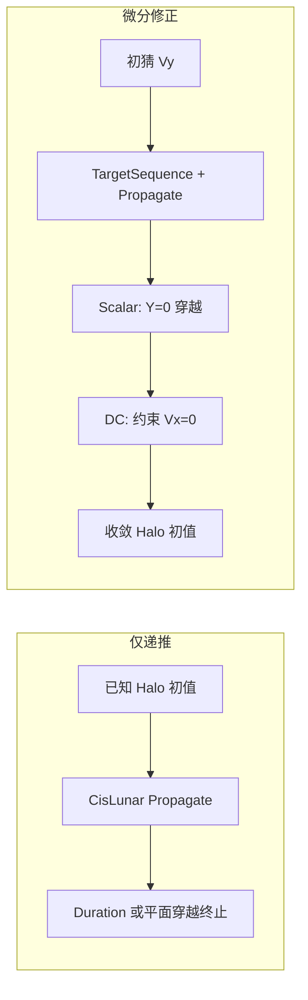

# 地月平动点 (Earth-Moon Libration) 轨道设计

本文档说明如何在 Astrogator MCS 中设计地月平动点附近的 **Halo 轨道**,以及与之相关的 **DRO** 示例。所有示例均通过 `POST /Astrogator/RunMCS` 调用,积分器为 **`CisLunar`**(地月多体/CR3BP)。

## 1. 概念与坐标系

### 1.1 地月 CR3BP 与平动点

在地月 **圆型限制性三体问题 (CR3BP)** 中,地球与月球共同引力场存在五个 **Lagrange 平动点** L1–L5:

| 平动点 | 位置特征 | 本仓库示例 |
| --- | --- | --- |
| **L1** | 地月连线,介于地球与月球之间 | `Moon L1` 坐标系, Halo Target/Propagate |
| **L2** | 地月连线,月球背地一侧 | `Moon L2` 坐标系, Halo Target/Propagate |
| L3 | 地月连线,地球背月一侧 | 后续可扩展 |
| L4/L5 | 地月三角拉格朗日点 | 后续可扩展 |

### 1.2 三种常用坐标系

| 坐标系名称 | 原点 | 典型用途 |
| --- | --- | --- |
| **`Moon L1`** | L1 平动点 | L1 附近 Halo/Lyapunov 轨道设计 |
| **`Moon L2`** | L2 平动点 | L2 附近 Halo/NRHO 等轨道设计 |
| **`Moon Libration`** | 地月质心(旋转系) | DRO 等全局地月轨道设计 |

单位约定:位置 **m**,速度 **m/s**,时间 **s**,历元 **ISO8601 UTC**。

### 1.3 CisLunar 积分器

`PropagatorName: "CisLunar"` 为地月多体积分器,适用于:

- 地月平动点附近轨道(Halo, Lyapunov, NRHO)
- 地月转移(E2M)
- 地月旋转系下的 DRO

## 2. Halo 轨道设计原理

### 2.1 轨道特征

**Halo 轨道**是 L1/L2 附近围绕平动点的三维周期(或准周期)轨道,在 Moon L1/L2 局部坐标系中通常具有 **Z-X 平面对称性**:

- 初始点常取在 Z-X 平面上(`Y = 0`)
- 初始速度在 X-Z 平面内(`Vx = 0`, `Vz = 0`),仅留 `Vy`
- 递推至再次穿越 Z-X 平面时,要求 **`Vx = 0`**(垂直穿越),从而闭合/周期化轨道

### 2.2 两类工作流



| 工作流 | MCS 结构 | 适用场景 |
| --- | --- | --- |
| **仅递推** | `InitialState` + `Propagate` | 已有收敛 Halo 初值,外推轨迹 |
| **微分修正** | `TargetSequence`(含 DC) | 从初猜 `Vy` 迭代求解 Halo 初值 |

### 2.3 微分修正配置要点

以 L1 Halo 为例(详见 `mcs-target-eml-l1-halo-min.json`):

| 配置项 | 值 |
| --- | --- |
| 坐标系 | `Moon L1` |
| 初值位置 | `X=-5000 km, Y=0, Z=30000 km` |
| 初猜速度 | `Vy=204 m/s`(自变量) |
| 终止条件 | Scalar: `Moon L1` 的 `Y` 分量穿越 0, `ThresholdIncreasing` |
| 约束 | `L1_Vx = 0`(Tolerance 0.01 m/s) |

L2 Halo 差异:

- 坐标系改为 `Moon L2`
- 初值 `X=+5000 km`, 初猜 `Vy=-141 m/s`
- 终止条件 `Criterion: ThresholdDecreasing`(与 L1 对称方向相反)

## 3. 与 DRO 示例的关系

**DRO (Distant Retrograde Orbit)** 使用 **`Moon Libration`** 地月旋转系,而非 L1/L2 局部系:

- Fixture: [`../fixtures/mcs-target-dro-moon-libration-min.json`](../fixtures/mcs-target-dro-moon-libration-min.json)
- 上游参考: `raw/Astrogator/Target/EarthMoonLibration_250702.json`

DRO 与 Halo 同属 CisLunar 地月多体族,但坐标系与初值几何不同。Halo 在 L1/L2 局部系下设计;DRO 在全局旋转系下设计。

## 4. Fixtures 示例对照

| Fixture | 类型 | 坐标系 | 初始状态要点 | 终止/约束 |
| --- | --- | --- | --- | --- |
| `earth-moon-libration/mcs-target-eml-l1-halo-min.json` | Target/DC | Moon L1 | X=-5e6, Z=3e7, Vy=204 | 穿越 Y=0; 约束 L1_Vx=0 |
| `earth-moon-libration/mcs-target-eml-l2-halo-min.json` | Target/DC | Moon L2 | X=+5e6, Z=3e7, Vy=-141 | 穿越 Y=0(Decreasing); 约束 L2_Vx=0 |
| `earth-moon-libration/mcs-propagate-eml-l1-halo-min.json` | Propagate | Moon L1 | 同上 | Duration 1051200 s (~12.2 d) |
| `earth-moon-libration/mcs-propagate-eml-l2-halo-min.json` | Propagate | Moon L2 | 同上 | Duration 1227600 s (~14.2 d) |
| `mcs-target-dro-moon-libration-min.json` | Target/DC | Moon Libration | X=-1.5e8, Vy=850 | 穿越 Y=0; 约束 EM_Vx=0 |

上游 raw 参考:

| raw 文件 | 对应 fixture |
| --- | --- |
| `raw/Astrogator/Target/EarthMoonL1_250704.json` | `mcs-target-eml-l1-halo-min.json` |
| `raw/Astrogator/Target/EarthMoonL2_250704.json` | `mcs-target-eml-l2-halo-min.json` |
| `raw/Astrogator/Propagate/EarthMoonL1_250704.json` | `mcs-propagate-eml-l1-halo-min.json` |
| `raw/Astrogator/Propagate/EarthMoonL2_250704.json` | `mcs-propagate-eml-l2-halo-min.json` |

## 5. curl 快速调用

```bash
export BASE_URL=http://astrox.cn:8765

# L1 Halo 微分修正
curl "${BASE_URL}/Astrogator/RunMCS" \
  --request POST \
  --header 'Content-Type: application/json' \
  --data-binary "@skills/astrogator/fixtures/earth-moon-libration/mcs-target-eml-l1-halo-min.json"

# L2 Halo 微分修正
curl "${BASE_URL}/Astrogator/RunMCS" \
  --request POST \
  --header 'Content-Type: application/json' \
  --data-binary "@skills/astrogator/fixtures/earth-moon-libration/mcs-target-eml-l2-halo-min.json"

# L1 Halo 仅递推
curl "${BASE_URL}/Astrogator/RunMCS" \
  --request POST \
  --header 'Content-Type: application/json' \
  --data-binary "@skills/astrogator/fixtures/earth-moon-libration/mcs-propagate-eml-l1-halo-min.json"

# L2 Halo 仅递推
curl "${BASE_URL}/Astrogator/RunMCS" \
  --request POST \
  --header 'Content-Type: application/json' \
  --data-binary "@skills/astrogator/fixtures/earth-moon-libration/mcs-propagate-eml-l2-halo-min.json"
```

成功判定: HTTP 200 且响应 JSON 中 `IsSuccess: true`。

## 6. 扩展指引

后续可在 `fixtures/earth-moon-libration/` 追加:

- **L3/L4/L5** 平动点轨道(需对应坐标系名称,如 `Moon L3` 等,以 API 支持为准)
- **Lyapunov 轨道**: 平面内周期轨道,通常约束与 Halo 不同(如 Z=0 平面)
- **NRHO (Near Rectilinear Halo Orbit)**: L2 附近高振幅 Halo 变体
- **Southern Halo**: 改变 Z 初值符号得到南支 Halo

编写新 fixture 时,优先在 `raw/Astrogator/Target/` 或 `raw/Astrogator/Propagate/` 查找相近 JSON,再裁剪为 `mcs-*-min.json`。

## 7. 相关 API(非 MCS)

OpenAPI 还提供 `POST /OrbitSystem/EarthMoonLibration`,输入为 `EntityPositionCzml`(已有 Czml 轨迹),输出带 STM 的 Czml 位置。Halo **初值设计**主路径仍是 Astrogator MCS;该端点适用于已有轨迹的平动点系变换/分析场景。
